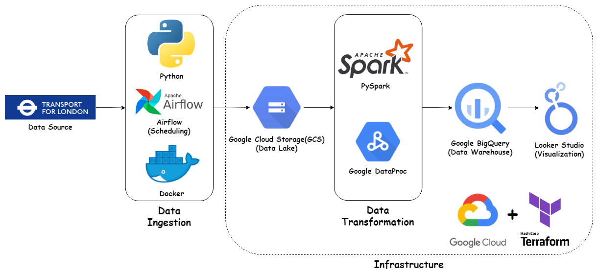
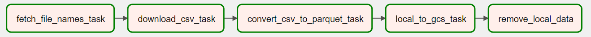
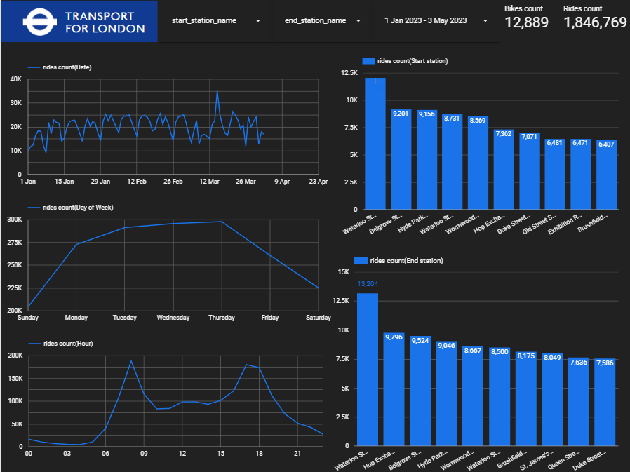

# London's TFL cycling data pipeline


The goal of this project is to analyze the cycling usage patterns in London using data provided by Transport for London (TfL) in order to understand popular cycling routes, and trends in bicycle usage. 


# Data set
data source: https://cycling.data.tfl.gov.uk/

The datasets are saved in CSV format, separated by commas.

Column Name | Description
| :---: | :---:
Rental Id	 | A distinct identifier for each ride
Duration	 | The length of time the ride lasts
Bike Id   | A distinct identifier for the bicycle
End Date | The time at which the ride ended
EndStation Id  | A distinct identifier for the destination station
EndStation Name  | The name of the station where the ride ends
Start Date  | The time at which the ride started
StartStation Id  | A distinct identifier for the origin station
StartStation Name  | The name of the station where the ride begins

# Overview of the Pipeline:



The project utilizes the following tools and technologies to create an end-to-end data engineering pipeline:

1. Google Cloud Platform (GCP): Cloud infrastructure for data storage, processing, and analytics.
2. Google Cloud Storage (GCS): Storage service to store raw and processed datasets (data lake).
3. Google Cloud Dataproc: Managed Apache Spark and Hadoop service for fast data processing and transformation.
4. BigQuery: Serverless, scalable data warehouse for data analytics.
5. Terraform: Infrastructure as Code (IaC) to automate and manage GCP resources.
6. Apache Airflow: Workflow management platform for data pipelines.
7. PySpark: Python library for Apache Spark, a fast and general-purpose cluster-computing system for big data processing.
8. Looker Studio: Data visualization and business intelligence platform for creating interactive dashboards.


## The pipeline can be broken down into the following steps:

a. __Data Ingestion__:   
Using Apache Airflow, a Directed Acyclic Graph (DAG) will be scheduled to initiate the data ingestion process. The CSV files containing cycling usage data will be downloaded and converted into Parquet format for efficient storage and processing. These Parquet files will then be stored in Google Cloud Storage (GCS).   

Airflow pipeline:



b. __Data Transformation__:   
PySpark, in conjunction with Google Cloud Dataproc, will be employed to perform the necessary data transformations on the Parquet files. These transformations will involve cleaning, filtering, and aggregating the data to derive meaningful insights.

c. __Data Storage__:  
After the data transformation process, the transformed data will be loaded into Google BigQuery. BigQuery serves as a suitable storage solution due to its ability to handle large volumes of data and perform real-time analytics.

d. __Data Visualization__: Looker Studio will be used to connect to BigQuery and design interactive visualizations and dashboards that provide insights into cycling usage patterns in London. This will enable stakeholders to make data-driven decisions and monitor the impact of their interventions on cycling infrastructure.

# Dashboard
A dashboard will be created using Looker Studio to visualize key metrics and insights from the analysis.

[Link](https://lookerstudio.google.com/reporting/a56e8e4e-1648-4819-9e41-34aa22c22b07)




# Setup the pipeline
To set up and run the project, follow these steps:

1. Clone the repository from GitHub:  
 `git clone https://github.com/bruceewue/de_zoomcamp_tfl_cycling.git`

2. Set up a Google Cloud Platform account and create a new project. Install the Google Cloud SDK and authenticate your account: gcloud auth 


3. Install Terraform, initialize and apply the Terraform configuration to create GCP resources:the project:  [Reference](https://github.com/DataTalksClub/data-engineering-zoomcamp/tree/main/week_1_basics_n_setup/1_terraform_gcp/terraform)  

```bash
terraform init 
terraform plan 
terraform apply
```


4. Set up Apache Airflow.

In your docker-compose.yml file, you need to provide your own Google Cloud Platform (GCP) Project ID and Google Cloud Storage (GCS) bucket information. 
(__GCP_PROJECT_ID__ & __GCP_GCS_BUCKET__)
[Reference](
https://github.com/DataTalksClub/data-engineering-zoomcamp/blob/main/cohorts/2022/week_2_data_ingestion/airflow/1_setup_official.md)  


Next, open your web browser and navigate to the Airflow web server URL: http://localhost:8080, and manually trigger a task run, click the play button located next to the DAG name
Once your DAG runs successfully, you will see that the Parquet files have been stored in your data lake, which is located in Google Cloud Storage (GCS).

5. Pyspark & Dataproc  
First, enable the Dataproc API and create a new cluster. Then, execute the following command:

```bash
cd spark
# upload pyspark file to GCS
gsutil cp spark_sql_big_query.py gs://GCP_GCS_BUCKET/code/spark_sql_big_query.py
# submit a PySpark job to your Dataproc cluster
gcloud dataproc jobs submit pyspark\ 
   --cluster=YOUR_CLUSTER \
   --region=europe-west1
   --jars=gs://spark-lib/bigquery/spark-bigquery-latest_2.12.jar gs://cycling_data_lake_cycling-uk/code/spark_sql_big_query.py \
   -- \
     --input=gs://GCP_GCS_BUCKET/raw/\
     --output=YOUR_BIGQUERY_TABLE
```


Once the PySpark job completes successfully, the transformed data will be stored in the specified BigQuery table.